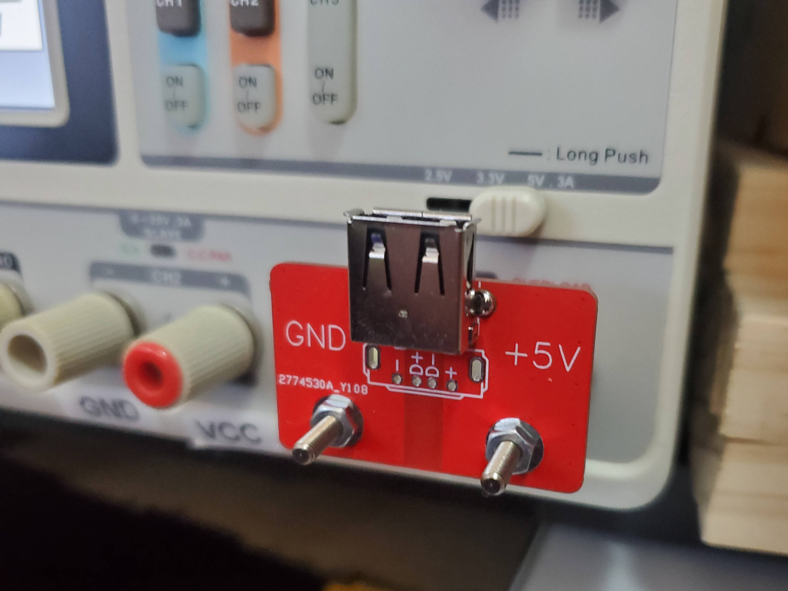
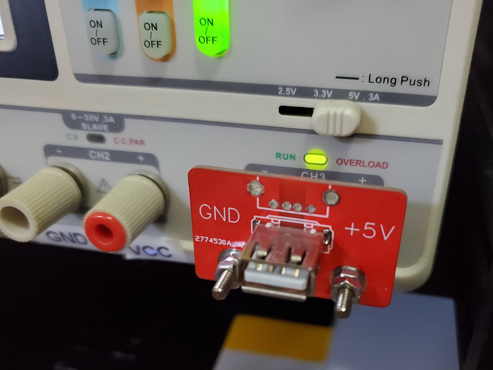

Benchtop power supply adapter
=============================

USB power from from the banana jacks on a benchtop power supply.

Notes
-----

You should really only use one USB connector at a time... probably best to only load one or the other.

This board was designed to fit on my benchtop power supply but other power supplies may have:

* Different space between positive/negative terminals - 
* The positive/negative terminals on opposite sides - You could try flipping the board over and mounting the banana plugs on the other side. Don't flip the USB connectors though. That should work but a) hasn't been tested and b) leaves you using the side of the board with a less helpful silkscreen... easy to fix if you're changing the board though.

Parts
-----

* Banana plugs - Something screw on with approximatly an M3 thread - Recommended parts:
    * [Pomona Electronics 72918](https://www.digikey.com/en/products/detail/pomona-electronics/72918/1196334)
* USB vertical - Pretty much any vertical, through hole mounting USB type A female connector should work - Recommended parts:
    * [BOOMELE(Boom Precision Elec) C16722](https://lcsc.com/product-detail/USB-Connectors_BOOMELE-Boom-Precision-Elec-C16722_C16722.html)
* USB right angle - Pretty much any right angle, through hole mounting USB type A female connector should work - Recommended parts:
    * [Jing Extension of the Electronic Co. 902-131A1011D10100](https://lcsc.com/product-detail/USB-Connectors_Jing-Extension-of-the-Electronic-Co-902-131A1011D10100_C2345.html)

Licence
-------

Copyright © 2022 Phil Baldwin

This work is licensed under a Creative Commons Attribution-ShareAlike 4.0 International License.

You should have received a copy of the license along with this work. If not, see <http://creativecommons.org/licenses/by-sa/4.0/>.
